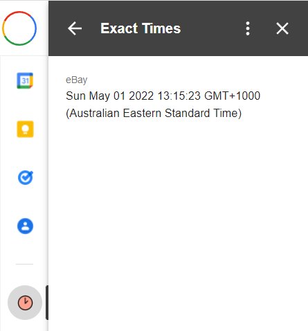

# Home
An add-on to see exact email times in Gmail.

Gmail shows you when an email was sent to the nearest minute, but sometimes you need to know the exact second it was sent, for example when automated dioagnostic emails are sent. This add-on allows you to see the exact time for each message in the current thread.

## Fine print

Your emails are only stored in Gmail, your data does not leave Google's servers.
* Read more on the [privacy](privacy.md) and [terms of service](terms.md) pages.

If you like ExactTimes, feel free to [buy me a coffee](https://ko-fi.com/davidlang42).

As ExactTimes is open-source, you can find the full source code at: [https://github.com/davidlang42/exacttimes](https://github.com/davidlang42/exacttimes)
